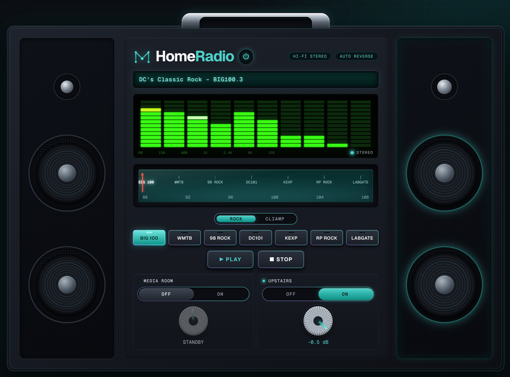

<p align="center"></p>

# homeradio
> a mechub project — an 80s boom box in the browser for your Yamaha receiver

An 80s boom box in the browser that plays internet radio through a Yamaha
receiver, in one room, another room, or both. Anyone on the LAN can use it.

<p align="center"></p>

- **Two zones.** A MEDIA ROOM / UPSTAIRS (receiver main + zone2) on-off switch and a
  volume knob per room, 7 presets and a tuning dial that follow a
  ROCK/CLIAMP/MY band switch, PLAY and STOP.
- **MY stations and search.** The search button looks up the public Radio Browser
  directory by name or genre. The star on the display keeps a station in MY, one
  shared list for the household (up to 50), stored in `cache_dir/my-stations.json`.
- **Master power.** A power button by the logo: off stops the radio and puts both
  zones in standby (TV included); on wakes the main zone.
- **Volume caps.** The knobs stop at per-zone caps set in the config, and the server
  enforces them too.
- **Safety.** Starting the radio never hijacks a TV on HDMI. AirPlay powers both
  zones on, and radio-web puts back whatever you didn't select.
- **AirPlay only while playing.** The AirPlay session exists only while playing. A
  watchdog re-handshakes if the receiver drops it, but never while another AirPlay
  sender has it.

## Requirements

- A Yamaha receiver with the network Extended Control (YXC) API and AirPlay. Tested
  only on an RX-V679 with zones main + zone2.
- A Debian 13 machine (box, VM or container) on the same LAN as the receiver.
- A Rust toolchain on the build machine.
- `cliamp` (pinned, checksum-verified) and `ffmpeg` are installed by `provision.sh`.

## Architecture

```
browser ──HTTP──▶ radio-web (Rust/axum :8080) ─ YXC HTTP ─▶ receiver
                  cliamp --daemon ─▶ PipeWire ─▶ raop-sink.service ─ AirPlay ─▶ receiver :5000
```

All services run as the user `radio` (with linger), as systemd **user** units.

## Layout

| Path | What |
|---|---|
| `src/` | radio-web: API (`docs/API.md`), zone policy, YXC client, cliamp adapter, title parser |
| `web/` | Boom box UI (vanilla HTML/CSS/JS, embedded into the binary) |
| `config/` | `stations.toml` (curated ROCK list), `config.example.toml` |
| `deploy/` | `make-bundle.sh`, `provision.sh` (idempotent), PipeWire and systemd user units, Caddy and nftables examples |
| `docs/` | `API.md` (binding contract plus verified facts) |

## Install

```sh
./deploy/make-bundle.sh            # builds and stages target/bundle
scp -r target/bundle you@host:     # copy it to the Debian host
# on the host, as root:
./bundle/provision.sh
```

If there is no `/etc/home-radio/config.toml` yet, the first run installs the example
there and exits. Set `receiver_url` to your receiver's address, then run
`provision.sh` again. It is safe to re-run; it never overwrites an existing config.
The same address feeds the AirPlay sink (`raop.ip` in `pipewire/raop-sink.conf`).

Check it:

```sh
curl http://<host>:8080/healthz
runuser -u radio -- env XDG_RUNTIME_DIR=/run/user/$(id -u radio) \
  systemctl --user status radio-web cliamp raop-sink
```

## Configure

`/etc/home-radio/config.toml` (see `config/config.example.toml`):

- `receiver_url` (required): the receiver's Extended Control API, e.g. `http://192.168.1.50`.
- `[zones.main]` and `[zones.zone2]`: `label`, `cap_db` (maximum volume) and
  `start_db` (volume when powering on from standby). Each zone must satisfy
  `-80.5 <= start_db <= cap_db <= 0.0`, or radio-web refuses to start.
- `listen`, `cliamp_bin`, `stations_file`, `cache_dir`, `remote_stations_url`,
  `raop_unit`: defaults are in the example.

Stations live in `stations.toml` (`config/stations.toml` in the repo, copied to
`/etc/home-radio/stations.toml`). Clients only ever send station ids. Edit it and
re-run `provision.sh`.

### Optional: HTTPS and firewall

Neither is installed unless you add it to the bundle directory before copying it.

- **Caddy.** Copy `deploy/caddy/Caddyfile.example` to `caddy/Caddyfile` in the bundle,
  set your hostname and host IP, and put `fullchain.pem` and `privkey.pem` in
  `/etc/caddy/certs` on the host. Caddy does no ACME itself. Until the certificate
  exists, Caddy stays stopped.
- **nftables.** Copy `deploy/nftables.conf.example` to `nftables.conf` in the bundle
  and set your LAN and receiver IP. It replaces the host's whole ruleset and
  redirects TCP 80 to 8080.

## Develop

```sh
cargo test && cargo clippy --all-targets -- -D warnings
```

## Verified facts that bit us

- **Volume scale.** Volume is `db = raw*0.5 - 80.5` with raw 0–161, so 161 is
  **0 dB**, not +16.5.
- **Busy after power-on.** Right after a zone powers on, setters return
  `response_code 5` (busy), and the receiver forces zone2 to 161. radio-web retries,
  waits for power-on, then sets the start volume.
- **Standby.** The receiver rejects volume and mute while a zone is in standby. The
  API answers 409 `zone_off`.
- **RAOP session lifetime.** PipeWire's RAOP sink holds the RTSP session for as long
  as it is loaded. That's why it's an on-demand unit. A null "Silence" sink keeps
  cliamp from blocking when no AirPlay sink exists.
- **Codecs.** cliamp needs `ffmpeg` for AAC streams (BIG 100, DC101, 98 Rock, KEXP).
- **Titles.** iHeart now-playing arrives in `snapshot.track.stream_title` in one of
  three formats: `title="…",artist="…"`, `text="…"`, or `Artist - text="…"`.

## Known limits

- **One AirPlay sender at a time.** Any other device streaming AirPlay to the receiver
  will contend with radio-web for the session.
- **One receiver model.** Tested only on an RX-V679; other Yamaha models may differ.
- **Receiver unplugged and TV-on-HDMI.** These are covered by integration tests,
  not by a live test.

## More from mechub

homeradio is a for-fun side project. The serious mechub work lives in the
[mechubsec](https://github.com/mechubsec) org on GitHub: network-security
automation, MCP servers for Junos, PAN-OS, Mist and Proxmox, and firewall
config tooling.

## License

Licensed under [MIT](LICENSE).
